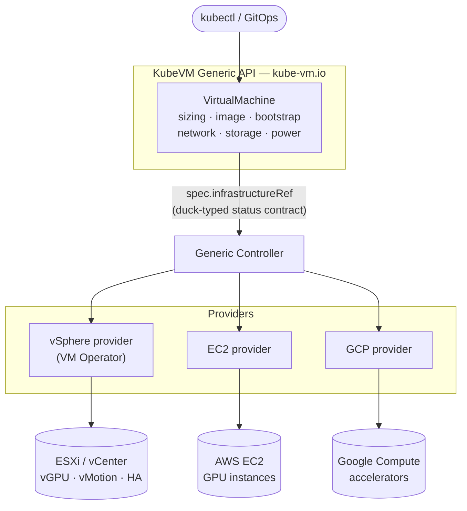

# KubeVM — A Generic, Provider-Agnostic Virtual Machine API for Kubernetes

**Author:** Arunesh Pandey · **Status:** Proposal, open for discussion

This is a design proposal, not an accepted API.
The types it describes, the generic core controller, and a working vSphere
provider integration are implemented in this repository so the shape can be
reviewed against something that actually reconciles a VM end to end, not
only as a Go snippet in a document; see the repository README for what is
and is not built, and *Demos* below for the vSphere provider in action, plus
an EC2 prototype demonstrating that the contract generalizes.

## Business Problem

Kubernetes has become the default control plane for modern infrastructure, yet the ecosystem still lacks a cross-platform, VM-centric API: a single declarative surface through which any hypervisor or cloud can expose both the full lifecycle of a virtual machine and the hardware capabilities that demanding workloads depend on.
This gap is becoming urgent because a new class of workload is arriving faster than the tooling to run it.
Agentic workloads — long-running processes that execute model-generated code and orchestrate tools — are increasingly deployed inside virtual machines, both for the strong isolation a VM provides around untrusted code and for direct access to the hardware accelerators, such as GPUs, SR-IOV network functions, and passthrough devices, that hypervisors already virtualize well.
The community needs a credible way to run these workloads, and today it does not have one.

The CNCF landscape today addresses adjacent needs but not this one.
Kata Containers provides VM-strength isolation for individual workloads by wrapping a Pod in a lightweight micro-VM — well suited to isolating untrusted code at the granularity of a container.
KubeVirt takes a different approach, converging the virtual machine into the container model by running a QEMU/KVM process inside a Pod, which is an excellent fit when Kubernetes is the sole infrastructure layer and rich, device-level VM modeling on Kubernetes nodes is the goal.
Both are strong at their design point.
What neither sets out to be is a portable, Kubernetes-native front door to a full-blown, hypervisor-native estate — an existing vSphere deployment or a public-cloud VM service — that exposes that platform's own lifecycle and hardware capabilities (GPUs, SR-IOV, passthrough) through one vendor-neutral API.
That is the gap KubeVM fills, and it is complementary to both.

This document proposes **KubeVM**, a generic and vendor-neutral `VirtualMachine` API served under the `kube-vm.io` group, together with a provider model that lets hypervisors and cloud VM services expose their machines — and, critically, their accelerators — through one portable, Kubernetes-native interface.
KubeVM is intended to complement KubeVirt, not to replace it: it addresses the hypervisor-native design point that the VM-as-Pod model leaves unaddressed.
The `VirtualMachine` resource is the starting point rather than the whole proposal.
Standardizing the machine is what makes a set, a service, a rolling deployment — and eventually a workload model spanning both VMs and Pods — something the ecosystem writes once instead of once per platform.
That trajectory is described in *Beyond a single machine*, and it is where most of the long-term value of a generic API lies.

## Goals

- As a **DevOps user**, I should be able to declare a virtual machine — its size, image, bootstrap configuration, networking, storage, and accelerators — through a single portable API, regardless of the platform that ultimately runs it.
- As a **DevOps user**, I should be able to request GPU-backed VMs through the portable sizing profile, with the provider resolving that profile to its own accelerator representation.
  Note that this is a weaker guarantee than "identically everywhere": where a platform models accelerators as a separate per-instance attachment rather than as a property of the profile, v1 cannot express it.
  Richer accelerator types (SR-IOV, arbitrary passthrough) follow as a portable shape is established.
- As a **platform engineer**, I should be able to target different providers — vSphere, EC2, or GCP — with the same portable `VirtualMachine` schema, so that moving a workload means pointing at a different provider object and supplying that platform's specifics, not re-authoring the machine's shape.
- As a **provider author**, I should be able to ship a thin provider that maps the generic API onto my platform, implementing only the behavior that is genuinely unique to it.
- As a member of the **CNCF community**, I should have a hypervisor-native, vendor-neutral VM API that is well suited to agentic and accelerated workloads and that fills the gap left open by the VM-as-Pod model.

## Non Goals

- KubeVM does not replace KubeVirt.
  The VM-as-Pod model remains valid for clusters where Kubernetes is the only infrastructure layer, and KubeVM can even expose a KubeVirt provider; the two are complementary points in the design space.
- KubeVM is not itself a hypervisor or a virtualization implementation.
  It is an API and a set of controllers; the hypervisor or cloud is always the provider, and no nested virtualization is introduced.
- KubeVM does not re-implement hypervisor capabilities such as live migration, high availability, or resource scheduling on top of raw Kubernetes primitives.
  These are delegated to the provider that already implements them.
- A dedicated, portable accelerator/GPU field is not part of the initial version.
  Accelerators are requested through the compute-sizing profile (see *Hardware specification*); a standalone portable field waits for a Dynamic Resource Allocation (DRA) strategy that holds across providers.
- KubeVM ports the *declaration* of a machine, not a running instance's state or its disk contents.
  Cross-provider migration of a live VM or its data, and import of pre-existing VMs not created through the API, are out of scope for the initial version.
- Backup and disaster recovery, marketplace, and billing integrations are outside the scope of the initial version.

## Big Picture

The proposal introduces a new API group, `kube-vm.io`, whose central resource is a `VirtualMachine` supported by a small set of companion types for sizing, images, networking, and snapshots.
The design deliberately places the common surface — everything that is shared across backends — in the generic API, so that a provider needs to contribute only the settings that are unique to its platform.
A machine is bound to its backend through a Cluster-API-style `spec.infrastructureRef`, and the generic layer observes the backend exclusively through a duck-typed status contract: a small, fixed set of well-known status fields — provider identifier, power state, network addresses, a free-form provider-metadata map, and readiness expressed as conditions — that the contract *requires* each provider to surface at agreed field paths.
The generic core reads only those paths and imports no provider code, so it needs no per-provider translation and does not change when a provider is added.
A provider whose native status already carries the same information under its own field names — as VM Operator does today — publishes the contract fields on its own object alongside them.
This is no longer only a description: the contract is codified in code, and *The provider contract, concretely* below covers what that means and what else it settles.
A generic controller reconciles the `VirtualMachine` against its provider object, and each provider contributes a controller that translates the resolved intent into calls against its platform.
To keep the generic API from degenerating into the union of every vendor's feature set, a field is promoted into the portable core only once at least two providers converge on a common shape for it; until then it stays on the provider object where it originated.



An example makes the split concrete.
The user writes one portable `VirtualMachine` that carries the whole intent — power state, sizing (including any accelerator, via the sizing profile), boot image, networking, and bootstrap — and the provider object it points at carries only what cannot be said portably, such as a storage policy, a firewall attachment, or a cloud identity.
Here is a GPU workload written once against the sketched `kube-vm.io/v1alpha1` type.

```yaml
# Portable, user-authored resource — the machine's full intent in one place.
# Portable in shape, not in every value: the marked lines below resolve against
# whatever each platform's administrator has published under those names.
apiVersion: kube-vm.io/v1alpha1
kind: VirtualMachine
metadata:
  name: inference-01
  namespace: team-a
spec:
  powerState: PoweredOn
  # A GPU-bearing sizing profile: a VirtualMachineClass on vSphere, a GPU
  # instance type (e.g. g5 or p5) on EC2.
  instanceType:
    name: gpu-standard-16
  bootDisk:
    source:
      image:
        apiGroup: kube-vm.io
        kind: VirtualMachineImage
        name: ubuntu-2204-cuda
    sizeGiB: 100
    # Disk performance lives in an admin-published class, not in fields here.
    storageClassName: fast
  # Guest-wide settings sit beside the interface list.
  network:
    searchDomains:
      - team-a.example.com
    interfaces:
      - name: eth0
        network:
          apiGroup: infrastructure.vsphere.kube-vm.io
          kind: Network
          name: workload-net
        dhcp4: true
  bootstrap:
    cloudInit:
      # A Secret reference, never inline plaintext.
      userData:
        name: inference-01-userdata
        key: user-data
  sshPublicKeys:
    - "ssh-ed25519 AAAA... admin"
  # A backend-scoped value: resolves to a vSphere zone here, to an AWS
  # availability zone or a GCP zone on those backends.
  failureDomain: zone-a
  # The provider binding. Retargeting this VM at another platform means
  # changing the apiGroup and kind here, and supplying the corresponding
  # provider object shown below.
  infrastructureRef:
    apiGroup: infrastructure.vsphere.kube-vm.io
    kind: VSphereVirtualMachine
    name: inference-01
```

On vSphere, the referenced provider object holds only the vSphere-specific capabilities; sizing, image, networking, and bootstrap are all inherited from the portable object above and are not restated.

```yaml
# vSphere provider object — capability-only.
apiVersion: infrastructure.vsphere.kube-vm.io/v1alpha1
kind: VSphereVirtualMachine
metadata:
  name: inference-01
  namespace: team-a
spec:
  storagePolicy: vsan-default
  minHardwareVersion: 20
  bootOptions:
    efiSecureBoot: true
# status (provider-written): providerID, powerState, addresses, and readiness
# via the InfrastructureReady condition — see "The provider contract, concretely".
```

Retargeting the same workload to EC2 keeps the portable object's shape intact — its sizing, image, networking, and bootstrap are unchanged — and takes three edits: repoint `infrastructureRef` at the EC2 provider group and kind, repoint the network reference the same way, and supply the EC2 provider object, which carries what is irreducibly AWS-specific: the region, the firewall attachment, the named key pair, and the instance's IAM identity.
A handful of values *inside* the portable object are themselves backend-scoped — the `failureDomain`, the `storageClass`, and the names of the referenced network and image — and resolve against whatever each platform's administrator has published under those names, in the same way a Cluster API manifest depends on identically named classes existing on each management cluster.
The schema ports; those catalog names port by convention.

```yaml
# EC2 provider object — capability-only; same portable VM, different backend.
apiVersion: infrastructure.aws.kube-vm.io/v1alpha1
kind: AWSVirtualMachine
metadata:
  name: inference-01
  namespace: team-a
spec:
  region: us-west-2
  # A firewall attachment is a provider concept, not a portable one.
  securityGroupIDs:
    - sg-0abc123
  # A named EC2 key pair.
  keyName: team-a-bastion
  iamInstanceProfile: arn:aws:iam::123456789012:instance-profile/inference
# status (provider-written): providerID=aws:///us-west-2a/i-0…, powerState, addresses
```

The portable specification keeps the same shape in both cases; the provider binding and the provider object differ, and a few backend-scoped values inside the portable object (zone, storage class, network and image names) resolve per platform.
Each portable field resolves to the platform's native concept during reconciliation: `instanceType.name` selects a `VirtualMachineClass` on vSphere and an instance type on EC2; the image reference resolves to a Content Library item on vSphere and to an AMI on EC2; the cloud-init user-data is delivered through guest customization on vSphere and through instance user-data on EC2; and a GPU request — carried on the sizing profile — resolves to a vGPU-equipped `VirtualMachineClass` on vSphere and to a GPU-bearing instance type on EC2.
In this idealized shape the provider object never restates the portable intent — it exists to add the platform-specific capabilities that have no portable equivalent, and to publish status back through the contract.
(The vSphere provider is deliberately not idealized: it reuses VM Operator's full native CRD as the provider object, which is thicker — see *VM Operator, the vSphere provider*.)

## Architecture Areas

### The KubeVM API and the field-promotion philosophy

The API centers on a single user-facing resource, `kube-vm.io/VirtualMachine`, accompanied by companion types for sizing, images, networking, and snapshots.
Its guiding principle is that the generic API should carry every concept that is shared across backends, leaving a provider object to express only what is genuinely platform-specific.
To prevent the portable core from accreting a union of vendor features, a field is admitted into the generic API only after at least two providers converge on a common representation for it; until then, the field remains on the provider object where it originated.
This mirrors the pattern Cluster API established for `Machine` and its infrastructure objects, applied here to the lifecycle of a virtual machine.

### Hardware specification, including accelerators

KubeVM supports two complementary models for describing virtual hardware and unifies them under one API.
A machine may be sized by reference to a predefined class or instance type, in the manner of EC2 instance types, or it may be sized freely by specifying CPU and memory directly, in the manner of GCP custom machine types.

Accelerators ride on the sizing profile in the initial version rather than on a dedicated field, because that is where the target platforms already place them and it is the only shape that ports today.
A GPU is requested by selecting a sizing profile that carries one, and the provider resolves that profile to its native representation:

| Provider | Where the accelerator lives natively | How the sizing profile resolves |
|---|---|---|
| **vSphere (VM Operator)** | on the `VirtualMachineClass`: `spec.hardware.devices.vgpuDevices[].profileName` (mediated vGPU) or `dynamicDirectPathIODevices[]` (full PCI passthrough) | the provider resolves the profile to a `VirtualMachineClass` bearing the matching device and sets `spec.className` |
| **EC2** | intrinsic to the instance type (for example the `p5` and `g5` families) | the provider maps the profile to the matching GPU-bearing instance type |
| **GCP** | two distinct models. On `a2`/`a3`/`g2` the accelerator is built into the machine type. On `n1` it is a separate per-instance attachment, `guestAccelerators[]{acceleratorType, acceleratorCount}`, and **there is no GPU-bearing `n1` machine type** | the provider selects the matching machine type for the built-in families. The `n1` attach model is **not expressible in v1** — see below |

A dedicated, portable per-VM accelerator field is deferred in v1, and the argument for deferring it is weaker than it first appears — so it is worth stating precisely rather than glossing.

On vSphere and EC2 the accelerator genuinely is inseparable from the class or instance type: a vGPU is a property of the `VirtualMachineClass`, and on EC2 not only the GPU but its *count* is encoded in the instance type name (`g5.12xlarge` is four A10Gs, `g5.48xlarge` is eight).
For those two, a standalone field would collapse straight back into profile selection.
**GCP is different, and the difference is not cosmetic:** on `n1` machine types a GPU is a genuine per-instance attachment, and no GPU-bearing `n1` machine type exists — so "n1-standard-8 with two T4s" cannot be expressed through a sizing profile at all.
The per-instance attach model this section treats as hypothetical already exists on one of the three named providers.

So the honest position is not "no provider needs a separate field yet." It is that two of three do not, the third does, and v1 does not serve it.
This is a real gap in the portable core, and it lands on the capability the business case leads with.
The candidate shape — an optional `accelerators[{type, count}]` alongside the profile name, where profile-intrinsic providers *validate* the pairing and attach-model providers *attach* — is recorded as an open question rather than adopted, because settling it without a provider author from either cloud in the room is how the rest of this document's GCP claims went wrong.
Two further constraints belong with it when it is settled: an accelerated GCE instance must also set `onHostMaintenance: TERMINATE`, and on EC2 the GPU-bearing P and G families do not support hibernation, so an accelerated EC2 VM can never reach `Suspended`.

Dynamic Resource Allocation (DRA) remains the plausible Kubernetes-wide vehicle for a general attach model and is still maturing, but it is no longer the whole reason to wait.
SR-IOV and latency-sensitive scheduling are deferred on firmer ground — they live on the class or the provider object until two providers agree on a portable shape.
Note that EC2's analog, Elastic Fabric Adapter, is reached through a per-ENI `interfaceType` and a cluster placement group, neither of which the portable core models; multi-node GPU training on EC2 is therefore out of reach in v1.

### Image specification

A machine references its operating-system image through a portable identifier that each provider resolves to its native artifact — a vSphere Content Library item, an EC2 AMI, or a GCP image.
The generic layer defines how images are named and selected, while the resolution to a concrete artifact is the provider's responsibility.
OCI-based image distribution is under evaluation as a cross-provider format.
Because an image is an optional, provider-resolved resource, its availability is validated asynchronously during reconciliation rather than at admission time, which matches the behavior mature providers already exhibit.

### Storage

Disk performance is named, not described.
A disk carries a `storageClassName` and, for attributes that change over the disk's life, a `volumeAttributesClassName` — the same immutable-provisioning-class plus mutable-attributes-class pair a `PersistentVolumeClaim` carries, with the same mutability rules.
Nothing about IOPS, throughput, or disk type appears in this API.
That is deliberate: those knobs are real but they do not port, since EC2 decouples provisioned IOPS and throughput from size, GCE Hyperdisk does the same but gates it on machine family, and vSphere expresses the whole thing as a storage policy.
Putting platform-specific numbers with platform-specific limits into the portable object would defeat the point of having one.

Kubernetes has already standardized this.
`StorageClass` carries opaque, provisioner-specific parameters; the EBS and GCE PD CSI drivers already accept disk type, IOPS, and throughput there; and `VolumeAttributesClass`, generally available since Kubernetes 1.34, exists precisely to change those attributes on a live volume through the CSI `ModifyVolume` call.
Reusing that machinery is strictly better than restating it, and it is the same admin-curated-catalog-behind-a-stable-name pattern this API already uses for sizing profiles and images.

This is not a borrowed convention.
VM Operator's data volumes are *only* PersistentVolumeClaims — its volume source wraps the upstream `PersistentVolumeClaimVolumeSource` directly — so on the reference provider these classes already act through the genuine CSI path rather than as parameter carriers.
The intent is the same elsewhere: EC2 and GCP data disks provisioned through their existing CSI drivers, which both already implement `ModifyVolume`.

One honest asymmetry.
Data disks map onto this cleanly.
Boot disks are the harder case, because an image-provisioned root volume is not a claim on every platform — an EC2 instance's root device is created from the AMI's own block device mapping, and overriding it requires naming a device path that depends on the image.
So the classes apply to both, but the provisioning path behind a boot disk is not necessarily CSI, and the device-level details of overriding an image's root volume stay on the provider object.

### Networking

Networking is grouped under `spec.network` rather than hanging a bare interface list off the spec, because a few settings are properties of the guest as a whole rather than of any one adapter: a host name is singular, and a resolver list is conventionally system-wide.
Grouping those with the interface list keeps one concern in one place and leaves room for further guest-wide settings without widening the top-level spec — the same shape VM Operator arrived at independently.
Each interface attaches to a network by reference, because what a network *is* differs sharply between platforms, whereas the shape of an interface — its addressing, whether it requests DHCP, whether it needs an externally reachable address — does not.

The guest-wide fields are held to the same two-provider bar as everything else, and are limited to those the API can itself render into guest network configuration: vSphere applies them through guest customization, and the other targets apply them through cloud-init, whose network-config schema carries the same concepts.
Settings only one platform can honor stay on that provider's object — suppressing network configuration entirely is coherent on vSphere but meaningless on EC2, where an instance always has an elastic network interface, so it is not promoted here.

### Bootstrap

Guest bootstrapping is expressed through a portable reference to a bootstrap configuration, together with SSH key injection, which the provider then delivers through its own mechanism — guest customization, cloud user-data, or a metadata service.
The generic API standardizes the shape of the bootstrap request; the provider is responsible for injecting it into the guest.

v1 defines exactly one bootstrap path, cloud-init, and exactly one channel into it.
An earlier draft also carried a free-form metadata map, on the reasoning that several platforms expose a metadata service.
That was a mistake: on those platforms user-data *is* a metadata key — GCE delivers it as `metadata.items[]` keyed `user-data` — so the two were not two features but one wire with two doors, and the second door was inline on the object rather than Secret-backed and had no defined precedence against the first.
It has been removed as redundant.
A runtime guest-readable key/value channel is a genuinely different concept, does not belong under bootstrap, and is not portable yet: EC2 has no user-settable instance metadata map, and its nearest equivalent surfaces instance tags through IMDS, so there the concept collides with `spec.tags` rather than standing apart from it.

cloud-init is the baseline because it is the only path every reference platform can already deliver.
Other engines — Ignition, and Sysprep for Windows — are anticipated but deliberately not yet in the schema; adding one is an additive change, and naming it before a provider needs it would be speculative.
Note that this leaves a real gap rather than a theoretical one: Windows guests on EC2 are configured by EC2Launch v2, not cloud-init, so the portable bootstrap path does not currently reach them.

### Controllers

The generic controller reconciles the `VirtualMachine` against its provider object.
It does not write the provider object's spec.
Configuration reaches the platform because the provider reads the generic object it is linked to, which keeps platform-specific translation on the provider side where the platform knowledge already is.
The generic controller resolves the reference, adopts the object, reads the backend's observed state through the duck-typed status contract — a fixed set of well-known fields each provider surfaces at agreed paths on its own object — and rolls the provider identifier, power state, network addresses, and readiness up into the generic machine's status.
It also owns the lifecycle concerns that belong to the portable object, including finalizers, status conditions, and backoff on transient failure.
Because it interacts with the backend solely through the infrastructure reference and the status contract, the generic controller imports no provider code, and each provider evolves independently behind that contract.

### Providers

A provider has two responsibilities: it maps the resolved generic specification onto its platform's native API, and it surfaces status on the well-known field paths the contract requires.
How *thin* the provider object is varies.
A greenfield cloud provider can be a near-empty capability object plus a translation controller.
An established platform may instead reuse its existing rich CRD as the provider object — as the vSphere provider does with VM Operator's `VirtualMachine` (see below) — which is thicker but delivers immediate feature parity.
Either way the generic API carries the common surface, so the provider adds only what is platform-specific.

### The provider contract, concretely

The contract sketched above is not only prose.
It is codified in [`external/kubevm/controller/internal/contract/contract.go`](../controller/internal/contract/contract.go), a package that reads a fixed set of paths off a provider object's `status` — `providerID`, `powerState`, `addresses[]`, a free-form `providerMetadata` map, and two conditions, `InfrastructureReady` and `UpToDate` — entirely through `unstructured.Unstructured`, so it never imports a provider's typed API.
The condition is named `InfrastructureReady`, not `Ready`, because a provider may already reserve the literal `Ready` for a narrower meaning of its own: VM Operator does, for its guest readiness-probe result.
The generic `kube-vm.io/VirtualMachine` controller calls this package's `ReadStatus` against the adopted provider object and mirrors the result onto the generic object's own status; that reconciler is the executable form of the contract, not this document.
Reading status is only half of what the contract requires of a provider: before the core will adopt a provider object at all, that object must carry a `kube-vm.io/virtual-machine` annotation naming the generic object back.
Without it the core requeues indefinitely and reports the generic object as `NotAdopted`, rather than guessing at a link the provider never confirmed.
Once adoption is mutual, the core sets a controller owner reference on the provider object and deletes it when the generic object is deleted — so a provider author's obligation is exactly two things: annotate back, and surface the status paths above.

The second half of the contract is not a file but a principle, worth stating as plainly as it has been asked for: *any core lifecycle operation that is platform-dependent must not exist in the generic layer.*
Put concretely, against what this proposal already commits to elsewhere:

| Lifecycle concern | Owner | Where this is already said |
|---|---|---|
| Creating, reconfiguring, and deleting the backend instance | Provider | *Providers*: "maps the resolved generic specification onto its platform's native API" |
| Power on/off and suspend/resume, and how each is actually achieved | Provider | The generic object only carries the desired `powerState`; how a provider gets there is its own |
| Placement, scheduling, live migration, and high availability | Provider | *Non-Goals*: explicitly delegated to the platform that already implements them |
| Image/AMI/content-library resolution | Provider | *Image specification*: the provider resolves the portable reference to its native artifact |
| Delivering the bootstrap request (guest customization, cloud-init, EC2Launch) | Provider | *Bootstrap*: "the provider is responsible for injecting it into the guest" |
| Surfacing observed state at the fixed contract paths | Provider | The one write the provider owes the core |
| Reading that state and rolling it onto the generic object; finalizers, conditions, backoff on transient failure | Core | *Controllers*: "owns the lifecycle concerns that belong to the portable object" |
| Resolving and rebinding `spec.infrastructureRef`, including retargeting across providers | Core | The generic controller's own reconcile loop |

An operation several providers could plausibly implement the same way — a bootstrap request format, say — is not automatically core's to own outright.
Cluster API's answer to the same problem is a second, narrower provider contract for bootstrap providers, and *Beyond a single machine* already lists that as a near-term step for KubeVM, once cloud-init stops being the only path that needs one.
Until a shared shape like that exists and two providers have converged on it, an operation stays on the provider side of the line even if it looks generalizable in hindsight — the same two-provider convergence bar that governs field promotion (see *The KubeVM API and the field-promotion philosophy*) applies to behavior, not only to schema.

### VM Operator, the vSphere provider

[VM Operator](https://github.com/vmware-tanzu/vm-operator) serves as both the reference provider and the maturity anchor for the proposal.
It is a production Kubernetes-native VM controller, validated at twenty-five thousand virtual machines and shipping as the control plane for VMware's VM Service, and it exposes the full range of capabilities the design cares about, including virtual and passthrough GPUs, SR-IOV, vTPM, live migration through vMotion, and snapshots.
It was architected to be provider-agnostic from the outset — all vSphere-specific code is isolated under `pkg/providers/vsphere/`, alongside a `pkg/providers/fake/` implementation used to exercise the core against a non-vSphere backend — giving KubeVM a credible, shipping first backend.

One reconciliation to be explicit about, because it differs from the illustrative examples above.
Those examples show a bespoke, capability-only `VSphereVirtualMachine` provider object for clarity.
The vSphere realization differs from them: the provider object **is VM Operator's own `vmoperator.vmware.com/VirtualMachine` CRD, reused directly** — a full-featured, and therefore *thick*, object — rather than a slim bespoke type.
Reusing the native CRD buys day-one parity with everything VM Operator already does, at the cost of a thick provider object.
Fields the generic API owns are resolved by VM Operator from the generic object and persisted into its own spec: those that are immutable once set are resolved when the machine is created, and power state is kept in step on every reconcile.
The generic object is authoritative for those fields, so a direct edit to them on the provider object is reverted on the next reconcile, in the same way an edit to a Pod owned by a Deployment is.
In other words, "thin provider object" is the aspiration the generic API is built toward and is realistic for greenfield cloud providers; a mature platform's provider may reasonably trade thinness for parity.
This is also the strongest argument that the design generalizes: it has to accommodate a provider whose native API is richer than the portable core, not only providers built to fit it.

### Security and tenancy

KubeVM inherits Kubernetes' namespace and RBAC model as its tenancy boundary and adds no new authorization mechanism of its own.
Both the portable `VirtualMachine` and the provider object are namespaced resources, so an administrator governs who may create machines — and against which provider — with standard Kubernetes RBAC, scoped per namespace or cluster-wide.
Administrators control the catalog a tenant can consume by publishing the sizing profiles (classes and instance types) and images a namespace is allowed to reference: these are exposed either as namespaced resources associated with specific namespaces, or as cluster-scoped resources available fleet-wide, so a tenant can size and boot a machine only from an approved set.
The sensitive surface is the provider object that carries a cloud identity — an EC2 IAM instance profile, a GCP service account — because referencing one grants the resulting VM that identity; administrators constrain this through RBAC on the provider object and through the provider's own validating webhooks, so a namespaced user cannot attach an arbitrary cloud role.
The trust boundary between a tenant's request and the provider's platform credentials is owned by the provider, where the platform-specific privilege model already lives.

### API versioning and skew

The generic API and each provider version independently, so the design follows Cluster API's contract-version approach rather than requiring lockstep releases.
A provider CRD advertises which contract version it satisfies through a well-known label — as CAPI infrastructure objects carry a version marker — and the generic controller reconciles any provider that satisfies a contract version it understands.
Each API, generic and provider alike, serves multiple versions behind conversion webhooks, so the stored and served representations can differ across an upgrade, and a newer generic core can continue to drive an older provider (and the reverse) as long as both share a supported contract version.
This lets the generic core, VM Operator, and the cloud providers upgrade on their own cadence, with the contract version — not a synchronized release train — as the compatibility gate.

## Beyond a single machine

A portable `VirtualMachine` is the substrate, not the destination.
The reason to standardize the machine first is that everything layered above it can then be written once.
A controller that maintains a set of machines, keeps them behind a stable network identity, or replaces them in waves during an image update needs to understand *a* machine — not vSphere's machine, EC2's machine, and GCE's machine as three separate problems.
That is where the leverage of a generic API actually comes from, and it is not something a provider-specific CRD can offer at any level of polish.

Kubernetes itself is the clearest precedent.
`Pod` alone did not drive adoption; `Deployment`, `Service`, `Job`, and the controllers layered above `Pod` did, and they were only possible because `Pod` was first a stable, portable contract.
Cluster API repeats the pattern: almost nobody authors a bare `Machine`, because the value lives in `MachineDeployment` and `MachineSet`, written once against a deliberately narrow portable object and reused by every infrastructure provider.
Read that way, a narrow portable core is not a shortcoming of this proposal but the precondition for the useful part.

The sequence below is ordered by dependency rather than ambition, since each step needs the one before it.

| Horizon | Resources | Why it is credible, and what it needs first |
|---|---|---|
| **Owed by v1** | `VirtualMachineImage` | Already referenced by `bootDisk.source.image` but not yet defined. The catalog question — whether images are portable types or provider-owned — has to be answered before the boot path is complete. |
| **Next** | `VirtualMachineTemplate`, `VirtualMachineSet` | A template is only worth its indirection once something fans out from it, so the two arrive together. `VirtualMachineSpec` is already a standalone, embeddable struct, so a template is additive rather than a restructuring — the same relationship `PodTemplateSpec` has to `PodSpec`. Providers need matching template kinds so a set can stamp out provider objects alongside portable ones. |
| **Next** | `VirtualMachineService` | The least speculative item here: VM Operator already ships a `VirtualMachineService`, so the shape has been exercised in production. Generalizing it means expressing membership by label selector and publishing endpoints the way a `Service` does, so that existing Kubernetes tooling and load balancers apply unchanged. |
| **Then** | `VirtualMachineDeployment` | Rolling replacement over a set. This is also where the strongest safety property of the Cluster API model becomes available: fields that cannot be changed on a live machine are handled by replacing the machine rather than by failing the edit, which a single hand-authored VM cannot do without destroying its disks. |
| **Then** | A bootstrap and customization provider contract | A second provider contract alongside the infrastructure one, mirroring Cluster API's separation of bootstrap providers from infrastructure providers. There is already a concrete gap driving it: the API defines cloud-init as its only bootstrap path, which does not reach Windows guests on platforms that use a different mechanism. |
| **Further out** | A workload model spanning VMs and Pods | Deliberately speculative. Once machines, sets, and services are portable, a higher-level workload composed of both virtual machines and Pods becomes expressible — an application whose database runs in a VM with passthrough storage and whose stateless tier runs in Pods, described and rolled out as one unit. This is the most valuable direction and the least specified; it is listed to show where the model leads, not as a commitment. |

One boundary is worth stating plainly, because it is easy to misread.
Everything above orchestrates *above* the machine and continues to delegate *below* it.
A `VirtualMachineDeployment` replacing machines in waves is workload orchestration; it is not this API re-implementing live migration, high availability, or host-level placement, which remain the provider's to implement and are listed as non-goals for exactly that reason.
The higher-level controllers add no new provider obligations beyond the machine contract itself.

This trajectory also sharpens the agentic case that motivates the proposal.
Workloads that create a sandbox per task need a set-shaped primitive, warm capacity, and fast replacement far more than they need any individual field on a single machine.
Those are properties of the layer above the machine, which is another reason to get the machine's contract right first rather than widening it.

None of this is part of the initial version, and the ordering is deliberate: each step assumes the contract beneath it is stable, and adding higher-level resources before the machine contract settles would bake today's open questions into more places than one.

## In this repository

- [`api/v1alpha1/`](../api/v1alpha1/) — the types this document describes
- [`config/crd/bases/`](../config/crd/bases/) — the generated CRD
- [`config/samples/virtualmachine.yaml`](../config/samples/virtualmachine.yaml) — a worked example
- [`controller/`](../controller/) — the generic core controller that reconciles a `VirtualMachine` against a provider object
- [`controller/internal/contract/`](../controller/internal/contract/) — the duck-typed status contract the core reads off a provider object
- [`README.md`](../README.md) — what is implemented, and the known gaps and open API questions

## Prior art and related work

The design draws on, and is meant to complement, the following:

- [Cluster API](https://cluster-api.sigs.k8s.io/) — the source of the
  `infrastructureRef` plus duck-typed status contract pattern this proposal
  applies to VMs rather than to Kubernetes nodes
- [KubeVirt](https://kubevirt.io/) — the VM-as-Pod design point, complementary
  rather than competing (see *Business Problem*); this proposal has been
  presented directly to the KubeVirt community, see *Community outreach*
- [Kata Containers](https://katacontainers.io/) — VM-strength isolation at
  container granularity, a different point in the same space
- [VM Operator](https://github.com/vmware-tanzu/vm-operator) — the reference
  provider and maturity anchor
- [AWS Controllers for Kubernetes](https://github.com/aws-controllers-k8s/ec2-controller)
  and [Azure Service Operator](https://github.com/Azure/azure-service-operator)
  — single-provider facades over a cloud VM API, studied as precedent for
  building an owned API surface rather than exposing a dependency's native one
- [virtrigaud](https://github.com/projectbeskar/virtrigaud) and
  [kubeswift](https://github.com/kubeswift/kubeswift) — independent attempts at
  a multi-hypervisor VM API, sources of the GPU-request shape and the
  status-side provider-metadata escape hatch

## Demos

The established provider is demonstrated end to end — creation, address reporting, and power lifecycle — against the contract described above, not only against the portable API in isolation. A second demo shows the same contract implemented against EC2, as a prototype confirming the contract generalizes beyond vSphere; that provider is not yet merged into this repository (see *ROADMAP.md*'s "second provider" milestone).

- **vSphere provider (VM Operator)**: <https://youtu.be/a2LksDuZlwc>
- **EC2 provider (prototype)**: <https://youtu.be/puJYxPvj2zU>

## Community outreach

This proposal has been taken beyond this repository, not only opened for comment on it:

- Presented to the CNCF TAG Workloads Foundation in a community meeting, and discussed on their [Slack channel](https://cloud-native.slack.com/archives/C08K71W9HAS/p1788991641325829); the response there was to ask for a demo, which *Demos* above now provides.
- Presented to the [KubeVirt community meeting](https://docs.google.com/document/d/1xkhG--2btgqTfvGBGu5BxnsesfgeCniaQg3yoZdzWyg/edit?tab=t.0#heading=h.la5p2q63th2g), and discussed on the [KubeVirt Slack channel](https://kubernetes.slack.com/archives/C8ED7RKFE/p1789116995367169) — KubeVirt is the project this proposal is most often compared against (see *Business Problem*), and so the one whose direct feedback matters most.
- Raised on both the CNCF and Kubernetes Slack instances more broadly, and in early conversations with engineers at Google, with similar outreach to Microsoft and Amazon underway.
- Tracked end to end, including the maturity and scope questions raised by CNCF TOC reviewers, in the [CNCF Sandbox application discussion](https://github.com/cncf/sandbox/issues/517).

## Feedback

This proposal is open for discussion, not only within this repository.
Comments on the API shape, the provider
contract, and the open questions listed in the repository README are all
welcome — particularly from anyone who would implement a provider, and
especially from the KubeVirt community given how often the two are compared.
The [CNCF Sandbox application](https://github.com/cncf/sandbox/issues/517) is
also open for review, and is where TOC-facing questions on maturity and scope
are being tracked as they come up.
